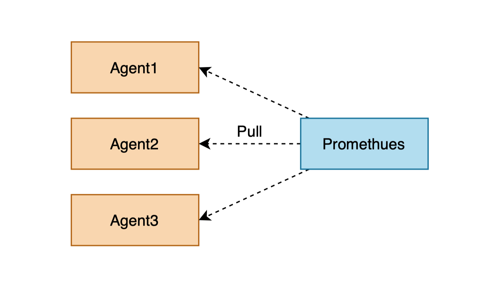

# 监控告警系统设计文档

## 1.监控背景

理想很丰满，现实和骨感。一切都在下图中:


线上生产环境如果出现服务故障，如资源使用过载，业务逻辑报错等问题，会直接影响用户正常使用服务。同时，当出现故障时，我们也希望可以快速将错误的告警信息告知运维人员，以保证业务服务的可用性。所以，在线上系统中，监控告警系统是必不可缺的，我们通过监控系统来监控服务的健康状况，业务接口响应时间，关键性能指标等状态。当服务出现问题时可以尽快联系运维人员，保留必要的错误快照信息方便开发人员排障和复盘。

我们系统监控达成的目标是:

1. **对系统不间断监控**：监控系统对业务服务系统实时监控，如果产生系统异常及时告警反馈给运维人员。
2. **不同维度的监控**：在系统运行的过程中，总是会产生意想不到的问题出现，如网络中断，系统资源使用异常，业务服务逻辑报错等情况，监控系统需要在性能指标，日志信息两个维度进行监控。
3. **完善的告警记录**：对所有告警信息进行持久化处理，当运维人员再次上线查看报错信息时，如是性能指标异常导致的告警，可以跟踪到发生异常的具体时间段和告警主体（如是CPU资源使用率异常可以找到什么时间范围内哪个机器产生的错误）。如是具体业务逻辑错误导致的告警，可以查询到触发异常的具体错误日志信息，结合排障手册进行问题分析和复现。

4. **排障闭环**：收到了告警信息，运维人员需要结合排障手册对出现的故障进行分析，并及时解决，形成`问题发生->问题发生->问题分析->问题解决`的完整闭环。


## 2.技术选型

监控告警功能系统是基于当前市面上的开源系统做了统一集成。主要通过使用telegraf+influxdb用作虚拟机指标监控，使用prometheus+ grafana用做基础指标监控，使用fELK用做业务服务日志监控。


### 2.1 telegraf  influxdb介绍 

Telegraf 是一个用 Go 编写的代理程序，是收集和报告指标和数据的代理。可收集系统和服务的统计数据，并写入到 InfluxDB 数据库。Telegraf 具有内存占用小的特点，通过插件系统开发人员可轻松添加支持其他服务的扩展。我们使用Telegraf用来定时获取VMware vCenter的虚拟机资源数据。

InfluxDB 是一个使用 Go 语言开发的开源的分布式时序、事件和指标数据库，无需外部依赖，其设计目标是实现分布式和水平伸缩扩展。

### 2.2 prometheus介绍

Prometheus是一套开源的监控&报警&时间序列数据库的组合,起始是由SoundCloud公司开发的。prometheus具有以下特点。

```
- 自定义多维数据模型(时序列数据由metric名和一组key/value标签组成)
- 非常高效的存储 平均一个采样数据占 ~3.5 bytes左右，320万的时间序列，每30秒采样，保持60天，消耗磁盘大概228G。
- 在多维度上灵活且强大的查询语言(PromQl)
- 不依赖分布式存储，支持单主节点工作
- 通过基于HTTP的pull方式采集时序数据
- 可以通过push gateway进行时序列数据推送(pushing)
- 可以通过服务发现或者静态配置去获取要采集的目标服务器
- 多种可视化图表及仪表盘支持
```

Prometheus 从根本上所有的存储都是按时间序列去实现的，相同的 metrics(指标名称) 和 label(一个或多个标签) 组成一条时间序列，不同的label表示不同的时间序列。为了支持一些查询，有时还会临时产生一些时间序列存储。


Prometheus可以采用Pull或者Push的方式获取监控指标数据，在本次监控设计中使用Pull方式对监控指标数据从采集服务点(Agent)进行拉取。





### 2.3 prometheus指标

#### 2.3.1 prometheus指标概述

每种监控系统都有对指标的一套定义与规范。promethues的所有监控指标被统一定义为：

```
<metric name>{<label name>=<label value>, ...}
```

一条指标有两种元素构成：指标名称与标签。<metric name>为指标名称，用于说明指标的含义，如http_request_total代表HTTP的请求总数。<label name>为标签，用于体现指标的维度特征，用于过滤与聚合。如指标http_request_total，可以有{status="200",method="POST"}和{status="200",method="GET"}这两个标签。在需要分别获取GET和POST返回200请求时，可分别使用上述指标，在只需要获取状态码为200的请求时，可以根据status="200"进行数据聚合。

#### 2.3.2 promethues指标类型

Promehtues指标分为Counter(计数器)，Gauge(仪表盘)，Histogram(直方图)和Summary (摘要)四种类型。


**Counter**

- Counter 用于累计值，例如 记录 请求次数、任务完成数、错误发生次数。

- 一直增加，不会减少。

- 重启进程后，会被重置。

  ```bash
    例如：http_response_total{method="GET",endpoint="/api/tracks"} 10
    10秒后抓取 http_response_total{method="GET",endpoint="/api/tracks"} 100
  ```

**Gauge**

- Gauge 常规数值，例如 温度变化、CPU,内存,网络使用变化。

- 可变大，可变小。

- 重启进程后，会被重置

  ```bash
    例如： memory_usage_bytes{host="master-01"} 100 < 抓取值
    memory_usage_bytes{host="master-01"} 30
    memory_usage_bytes{host="master-01"} 50
    memory_usage_bytes{host="master-01"} 80 < 抓取值
  ```

**Histogram**

Histogram反应了某个区间内的样本个数，通过{le="上边界"}指定这个范围内的样本数。Promethues中表示每个本地存储序列保存的chunk数量的指标promethues_local_storage_serries_chunks_persisted就属于Histogram指标类型。如下：

```
prometheus_local_storage_series_chunks_persisted{le="1.6384e+06"}  260
prometheus_local_storage_series_chunks_persisted{le="6.5536e+06"}  780
```

**Summary**

Summary与Histogram一样，都是属于高级指标，用于凸显数据的分布状况。如果需要了解某个时间段内的请求的响应时间，则通常使用平均响应时间，但这样做无法体现数据的长尾效应。如，一个HTTP服务器的正常响应时间是30ms，但是有很少几次请求耗时3s，通过平均响应时间很难甄别**长尾效应**。这时候可以通过Histogram或者Summary展现。Histogram和Summary这两种指标类型在本质上是可以相互转化的。

在Summary中使用到了分位数，ø代表分位数，0≤ø≤1，分位数代表ø*N排序的观测值。例如，0.9分为数代表第90%位置上的数，0.95分位代表95%位置上的数。如Promethues_tsdb_wal_fsync_duration_seconds 指标为Promthues Server中WAL写入磁盘的同步时间：

```
Promethues_wal_fsync_duration_seconds{quantile="0.5"} 0.012352463
Promethues_wal_fsync_duration_seconds{quantile="0.9"} 0.014458005
```

从而得出，有50%的同步时间低于0.012352463，有90%的同步时间低于0.014458005。

我们可以将Summary看做是客户端分位，它的优势是无需消耗服务端资源，但缺点也很明显：1.与Histogram采用Counter计数器统计的方式相比，Summary会消耗更多的资源；2.Summary计算的指标不能再获取平均数或者关联其他指标等。**所以Summary指标一般只是适用于独立的监控指标，例如垃圾回收时间等。**

### 2.4 grafana介绍 

 Grafana是一个开源的度量分析与可视化套件。 纯Javascript 开发的前端工具，通过多种数据源(如InfluxDB、Prometheus等），展示自定义报表、显示图表等。 大多使用在时序数据的监控方面，如同Kibana类似。 Grafana的UI更加灵活，有丰富的插件，功能强大。

它具有以下特点:

```
1. 可视化，可以支持多种画图方式，按照不同的需求绘制不同的图；我们可以给图表上添加具体指标的注释信息，方便运维人员理解。
2. 支持多种数据源，grafana可以对接丰富的数据源，如elasticsearch，prometheus和influxdb等，将不同数据源的数据可视化
3. 告警机制，可以在监控图标中动态配置告警规则，通过告警
4. 支持不同的数据源相应的语句，实现数据的聚合与查询。
```

在监控告警系统中，Grafana作为监控告警的入口，可以通过将Promethues和Influxdb数据以不同的方式可视化成图表方便运维人员查看。

### 2.5 felk介绍  

felk是filebeat、elasticsearch、logstash和kibana四个服务的首字母缩写，它们是市面上最成熟的日志监控方案之一。其中filebeat是节点上的日志采集服务；logstash将日志数据做结构化处理，将格式对齐并数据发送给elasticsearch；elasticsearch是一个分布式的存储引擎，支持海量存储于即时查询，方便统计与过滤分析，以索引的方式对数据进行分类存储；kibana是监控面板，与grafana类似，是对Elasticsearch的可视化面板。如下图所示：


Elasticsearch提供了丰富的查询和聚合功能。可以对索引进行生命周期管理，如超过时间范围内的数据进行冷热部署，删除等操作。

## 3.监控维度

监控告警系统从性能指标和业务日志数据两种数据类型进行监控数据指标的收集。

结合当前服务部署方案，我们通过telegraf+influxdb，node-exporter + prometheus,cadvisor+prometheus, kube-state-metrics + prometheus 分别进行Vmware层，GuestOS层，容器层，k8s层的性能指标监控。如：


在不同的监控维度，根据不同的监控指标进行监控，如下图：

**容器监控指标(docker/kubernetes)**


**客户机监控指标(GuestOS)**


**VMware层**


## 4.功能架构

告警系统主要分为三个模块：监控模块，展示模块与告警模块。监控告警系统总体功能架构如下图所示：


监控模块主要将基础性能指标与业务服务日志进行收集和存储（图上基础指标收集与展示面板部分）。VMware层面的基础性能指标通过telegraf服务采集，上报给influxdb。GuestOS层，容器层和kubernetes 资源层性能指标分别通过node-exporter，cadvisor和kube-state-metrics来进行采集，Prometheus通过Pull的方式对数据指标进行获取。业务服务的报错通常以日志的形式进行展现，比如业务服务报错打印错误堆栈信息等，监控系统主要filebeat对业务服务的日志进行采集，并上报给logstash进行日志数据的结构化处理，最终保存到Elasticsearch中。

展示模块以grafana做为监控入口，将数据进行可视化展示，同时可以在grafana上动态设置告警规则。grafana上支持多种数据源的展示，并根据不同的数据源进行聚合查询，在面板上展示具体指标的时序图。grafana根据不同维度集成不同维度的指标面板，方便运维人员对服务运行状态的检查。grafana提供统一的告警列表面板，可展示当前告警信息与告警历史记录。

对于告警信息而言，分为业务服务告警信息和基础性能指标告警信息。业务服务告警信息对业务服务的日志有一定的要求，需要日志格式包含跟踪号Traceid，如一次http请求调用所产生的所有相关日志都应该具有同一Traceid。这样在业务服务发生错误信息告警的时候会根据Traceid链接到Kibana界面中进行相关日志信息的全量查看。对于基础性能监控指标而言，如内存使用率在深夜激增，触发告警，但是在凌晨六点钟内存恢复为正常的状态，告警解除。我们可以在告警历史记录中将这条记录找到，根据告警触发和结束时间可以连接到指定环境进行问题排查。

告警模块是由alertmanager和alertwebhook组成的，alertmanager是Prometheus监控组件中一个开源的告警管理服务，它可以对告警信息进行分组、静默和抑制等操作。alertmanager负责将告警信息转发，可以对接短信，邮箱，webhook等。alertwebhook是自研的一个告警信息管理服务，它会持久化所有告警信息，更新告警状态。


