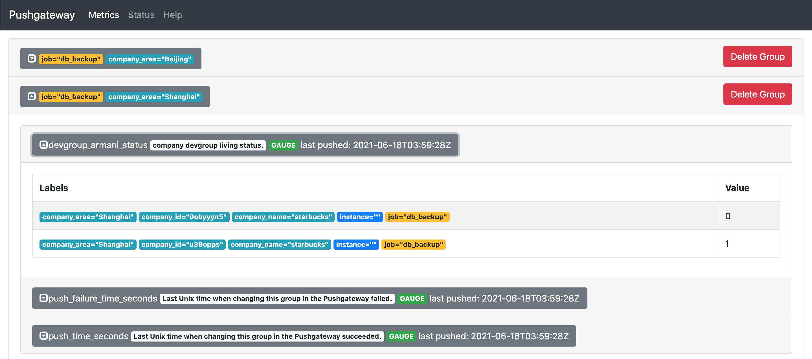

# Pushgateway

## overview

pushgateway只适用于有限的场景，如果监控指标可以使用pull模式获取，建议还是使用pull模式。同时使用pushgateway有
几个需要注意的点：

-   当pushgateway监控多个实例的时候，那么pushgateway可能成为性能瓶颈。

-   失去了up指标（在每次抓取时生成）失去了 Prometheus 的自动实例健康监控。

-   **Pushgateway 永远不会忘记推送给它的系列，并且会永远向 Prometheus 公开它们，除非通过 Pushgateway 的 API 手动删除这些timeseries。**

对于最后一点很重要的是，部署在不同机器上的同一个服务的instance label是不同的。当服务从机器A飘移到机器B，监控指标则会出现改变：

```
服务A在机器A上的监控指标:
server_up{name="server1",instance="A"}
服务A在机器B上的监控指标:
server_up{name="server1",instance="B"} 
```

但是Pushgateway不会自动删除`server_up{name="server1",instance="A"}`指标。


**通常情况下，Pushgateway的唯一有效用例是用于捕获服务级批处理作业的结果。** 服务级批处理作业指的是与特定机器与作业实例无关的批处理（也就是在监控指标中不去关心instance machine 等label）。

> 批处理的特点就是它们不会连续运行，这使得它们抓取变得困难。

批处理通常关键指标就是上一次执行时间（监控指标为gauge类型），通常还有一些特定于作业的总体统计数据可用于跟踪，例如处理的记录总数。

**对于每次时间间隔超过几分钟的批处理任务，可以通过`pull`方式进行拉取。也不见得一定要使用pushgateway**


## Pushgateway数据更新

```
Pushed metrics are managed in groups, identified by a grouping key of any number of labels, of which the first must be the job label
```

在pushgateway中，第一个标签是job，如果想对其设置更细粒度的标签，再添加标签。对于下面代码，则在pushgateway的界面中生成如图的数据： 

```
package main

import (
        "fmt"

        "github.com/prometheus/client_golang/prometheus"
        "github.com/prometheus/client_golang/prometheus/push"
)

func main() {
        armaniDev1GroupStatus := prometheus.NewGauge(prometheus.GaugeOpts{
                Name: "devgroup_armani_status",
                ConstLabels: map[string]string{"company_name":"starbucks","company_id":"u39opps"},
                Help: "company devgroup living status.",
        })
        armaniDev1GroupStatus.Set(1)

        armaniDev2GroupStatus := prometheus.NewGauge(prometheus.GaugeOpts{
                Name: "devgroup_armani_status",
                ConstLabels: map[string]string{"company_name":"starbucks","company_id":"0obyyyn5"},
                Help: "company devgroup living status.",
        })
        armaniDev2GroupStatus.Set(0)
				//db_backup为job标签名称，company_area为job下的分组的标签，可以通过不同的value来设置（如下图的Beijing和Shanghai）
        if err := push.New("http://localhost:9091", "db_backup").
                Collector(armaniDev1GroupStatus).Collector(armaniDev2GroupStatus).
								Grouping("company_area","Shanghai").
                Push(); err != nil {
                fmt.Println("Could not push completion time to Pushgateway:", err)
        }
}
```




Push()方法如果有相同的job及job下相同的标签push上来，则会把之前老的数据覆盖掉。
Add()方法只会对完全相同的标签数据才会进行覆盖，不会像Push()一样覆盖掉其他不冲突的数据。


## REF

[PUSHGATEWAY PROJECT](https://github.com/prometheus/pushgateway)

[WHEN TO USE THE PUSHGATEWAY](https://prometheus.io/docs/practices/pushing/)

[INSTRUMENTATION](https://prometheus.io/docs/practices/instrumentation/#batch-jobs)

