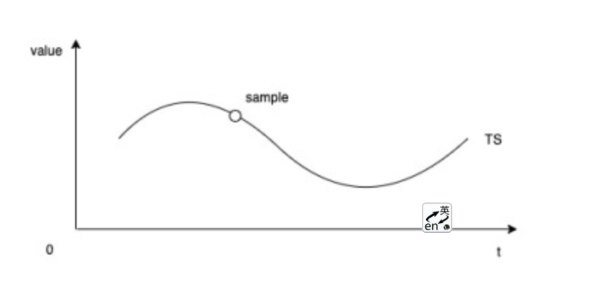
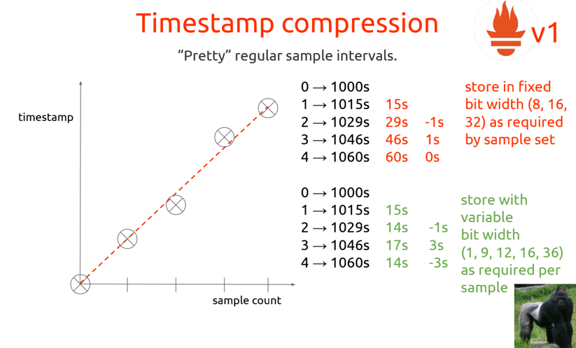
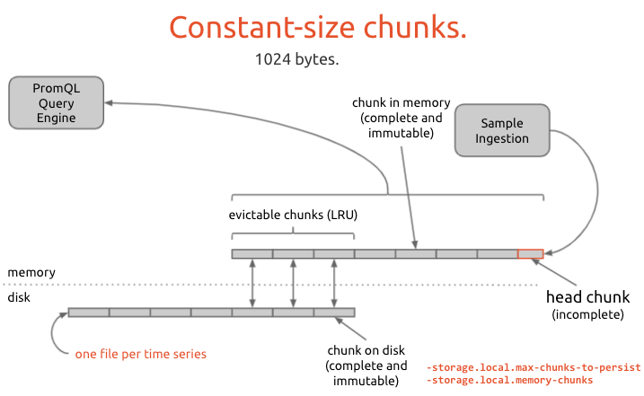

# TSDB

## TSDB介绍

TSDB（Time Series Database）专门存储随时间变化的数据，如股票价格、传感器数据、机器状态监控等。**时序 (Time Series)** 指的是某个变量随时间变化的所有历史，而**样本 (Sample)** 指的是历史中该变量的瞬时值：



对于存储引擎结构和性能优化方面，主要解决的是：

> 许多数据库的奇技淫巧都是在解决内存与磁盘的读写模式、性能的不匹配问题


与键值数据库相比，TSDB存储的数据更具有特殊的读写特征：**Vertical writes, horizontal(-ish) reads** **垂直写，水平读**


## [Promethues 存储层的演进](https://mp.weixin.qq.com/s/t9DfxeCzh1vcTzFYsojxJg)

Prometheus 存储层的演进可以分成 3 个阶段：

- 1st Generation: Prototype
- 2nd Generation: Prometheus V1
- 3rd Generation: Prometheus V2

### Data Model

每个时序(time series)是由多个标签构成的： 

> api_http_requests_total{path="/users",status=200,method="GET",instance="10.111.201.26"}

metric name是__name__标签的value:
> {__name__="api_http_requests_total",path="/users",status=200,method="GET", instance="10.111.201.26"}


### Generation: Prototype

在Prototype阶段，Prometheus直接使用Leveldb作为本地持久化存储。因为Leveldb是键值对数据库，所以该设计是将Prometheus 的 metrics、label、timestamp作为key，value作为value，如下图： 


因为与键值数据相比，时序数据具有更显著的特征，Promethues也希望在内存中可以容纳更多活跃的时序数据。虽然Leveldb也会压缩数据，但是达不到Prometheus的要求。**所以该方案最终流产。**


### Generation: Prometheus V1

compression： 高效的压缩可以大大减小存储压力（在key-value数据库之上继续压缩）

Chunked Storage Abstraction：

- Timestamp Compression： Double Delta
> prometheus是固定时间间隔pull模型，所以前后时间戳的差值基本固定，如15s、30s。那我们就不需要没有sample数据都保存timestamp，而是保存变化的差值即可。这就叫Double Delta
> 因为网络原因，或实例GC、重启等原因，采样间隔会有一些波动，但总体相差不大。
> 在这里，Prometheus采用了和FB的内存数据库Gorilla类似的方式编码时间戳，也可参考PromConn 2016的ppt。



- Value Compression
>Gorilla 利用float64 的二进制表示将前后两个样本值XOR来寻找压缩的空间，可以获得1.37bytes/sample的压缩能力。（相比与数值8个byte的存储，已经压缩了很多）
>Promethues V1中没有使用Gorilla的编码格式，而是自己做了一个简单的值判断来选择float32还是float64进行存储。压缩能力在3.3bytes/sample
>在Promethues V2中采用了Gorilla的压缩技术。

- Chunk Encoding

>chunk是一种批量的思想。Promethues V1将每个时序分割成大小为1KB的chunks，prometheus每次都往head chunk中写数据，一旦head chunk写满1KB，就会生成一个新的head
>chunk,当chunk写满1KB，则数据就不可变了。

可以参考prometheus V1中的下面几页ppt，讲的就是Chunk思路的。
```
constant-size chunks： 批量写入磁盘
series maintenance： 对于超过retention的数据，promethues会进行覆盖写
chunk preloading：PromQL的时候会将磁盘中数据载入到内存中
checkpointing： 防止宕机时可能会丢失没有落盘的数据，WAL的思路
```
在Promethues V1中，每个时序都会被存储在一个独占的文件中，也就意味着大量的时序会产生大量的文件。存储引擎会定期去检查磁盘中的时序文件，是否已经有chunk数据超过retention time，
如果有将其删除(复制后删除)。




### Generation: Prometheus V2

针对Promethues V1的一些缺点，主要是围绕着"一个时序一个文件"产生的相关问题，缺点如下: 


## Reference

[promethues存储层的演进](https://mp.weixin.qq.com/s/t9DfxeCzh1vcTzFYsojxJg)
[Gorilla paper]
[PromConn PPT]
