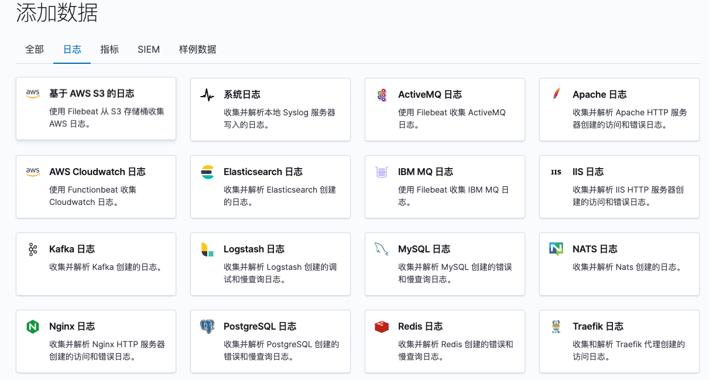

# elk容器部署

执行docker-compose.yaml文件，进行kibana和elasticsearch的安装：
```shell
docker-compose up -d -f docker-compose.yaml
```
查看服务执行情况：
```shell
docker-compose status -f docker-compose.yaml
```
在elasticsearch集群和kibana服务均启动的情况下，可以根据页面指引进行filebeat的安装：

进入一个日志服务，即可根据任意一个日志模块指引来安装filebeat服务。

对于logstash服务